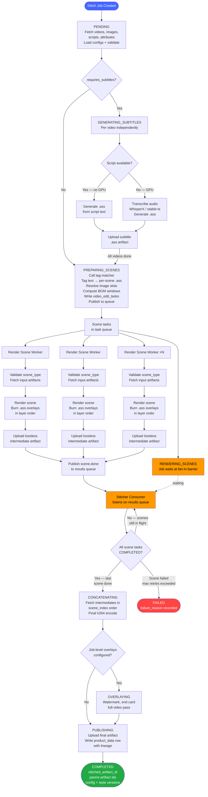

# Video Stitching Service — v2

A config-driven, event-driven service that stitches input videos and images into a
single product video. Every aspect of the output — scenes, boundaries, styling, and
overlays — is determined at runtime by versioned configuration. No code change is
required to modify the scene structure, visual treatment, or number of inputs.

---

## Table of Contents

1. [Functional Requirements](#functional-requirements)
2. [Non-Functional Requirements](#non-functional-requirements)
3. [High Level Design](#high-level-design)
   - [Stitching Service Overview](#stitching-service-overview)
   - [Architecture Diagram](#architecture-diagram)
4. [Job & Task State Machines](#job--task-state-machines)
   - [Stitch Job States](#stitch-job-states)
   - [Video Edit Task States](#video-edit-task-states)
5. [Event Contracts](#event-contracts)
6. [Data Model](#data-model)
   - [stitch_job](#stitch_job)
   - [video_edit_task](#video_edit_task)
   - [Scene Spec Schema](#scene-spec-schema)
   - [Configuration Tables](#configuration-tables)

---

## Functional Requirements

### Stitching
- Given generated videos and images, the service stitches them per a stitching/editing configuration.
- The number of input videos and images varies by configuration.
- Styling varies by configuration.
- The stitcher overlays various texts on the stitched video.

### Configuration Management
- The service resolves the stitching configuration and styling configuration from a versioned
  store, selected per request (by id/version), not hardcoded.
- A configuration defines scenes and scene boundaries (where in each source video a scene
  starts/ends, and how source duration is consumed).
- A configuration specifies whether subtitles are burned in (overall, and overridable per scene).
- A configuration specifies the number of input videos and images it requires.
- Scene types can be swapped within any configuration without code changes.
- The service rejects a configuration referencing an unknown scene type up front, rather than
  failing mid-render.

### Inputs & Enrichment
- The service resolves input videos, images, attributes (for overlay), and scripts for a given
  product/item from the source of record.
- It generates time-aligned subtitles from the video's audio or from the script. Subtitles
  generated from audio are corrected against the reference script text.
- It selects the best inputs (product images / attributes) using an LLM when the configuration
  calls for them.

### Output & Lineage
- The stitched video is stored as an artifact and recorded as a STITCHED_VIDEO in the product
  data store.
- The output records its lineage: the parent videos and images (by artifact id) and the
  configuration id + version that produced it.
- The per-item resolved timeline is persisted for audit and reproducibility.

---

## Non-Functional Requirements

### Reliability & Fault Tolerance
- Every pipeline step is independently retryable. A failure in any step does not require the
  job to restart from the beginning — only the failed step is retried.
- Every step is idempotent. Re-running a step or replaying an event produces the same output
  and does not duplicate work, artifacts, or database writes.
- The service is idempotent at the job level. Submitting the same item + configuration
  parameters more than once results in one job, not duplicates.
- A failed scene task does not fail the job. The job waits; only the failed scene is retried.
  The job fails only when a scene exceeds its maximum retry limit.
- No in-flight work is lost on worker restart. Job and scene state is persisted to the database
  before any message is acknowledged.
- Transient failures (network errors, 5xx responses) are retried with exponential backoff.
  Terminal failures (invalid configuration, unknown scene type, 4xx responses) fail immediately
  without retry.

### Scalability
- Multiple stitch jobs run concurrently.
- Scene rendering scales horizontally. Scenes within a job are independent tasks distributed
  across worker instances and rendered in parallel.
- Workers with different resource profiles scale independently. Subtitle generation is
  CPU-bound when a script is available and GPU-bound (WhisperX/stable-ts) when transcription
  is required; GPU workers scale separately from scene rendering (CPU-bound) and artifact
  upload (I/O-bound).
- Configuration and style resolution adds no per-job latency at scale. Config blobs are
  immutable once published; workers cache them and do not re-fetch per task.

### Observability
- Every job and scene task has a recorded state, failure reason, and per-step timing.
- A failed job records exactly which step and scene it failed at, with enough context to
  diagnose without log diving.
- The resolved timeline — the exact scene specs used to render a job — is persisted on the
  job record. Any output can be inspected or reproduced from the stored spec alone.

### Durability
- The stitched video artifact and its lineage are written atomically in the publish step.
  A partial publish is retryable without re-rendering.
- Intermediate scene artifacts are retained until the final stitched video is successfully
  published. They are garbage-collected after that point.
- Configuration rows are immutable once published. An active config version cannot be
  modified — only retired and replaced by a new version. In-flight jobs are never affected
  by a config change.

---

## High Level Design

### Stitching Service Overview

The stitching service is built around a central orchestrator called the **Stitcher**. The
Stitcher owns the lifecycle of a stitch job — it does not perform rendering itself. Its
responsibility is to coordinate work: resolving inputs, fanning out scene-level tasks,
tracking completion, and triggering job-level finalization in the correct order.

When a stitch job is created, it moves through three sequential preparation states before any
scene rendering begins.

In **PENDING**, the Stitcher fetches all inputs — videos, images, scripts, and product
attributes — from the source of record, and loads the `timeline_generation_config` and
`style_config` from the database. Scene types referenced in the config are validated against
`style_config.scene_type_presets` immediately; any unknown scene type fails the job before
any work is done.

If the config requires subtitles, the job advances to **GENERATING_SUBTITLES**. For each
input video independently: if a script is available, the subtitle `.ass` is generated directly
from the script text (no GPU). If no script is available, the video audio is transcribed via
WhisperX or stable-ts (GPU step), optionally corrected against a reference script, and the
`.ass` is produced from the transcript. Each `.ass` is uploaded to the artifact service as
soon as it is ready. Jobs with no subtitle requirement skip this state entirely.

In **PREPARING_SCENES**, the Stitcher calls the tag-matcher to get time-windowed text
annotations per scene and converts them to per-scene tag `.ass` files, resolves image picker
output to concrete artifact IDs per slot, and computes BGM audio time windows from scene
offsets. With all inputs resolved, it writes each scene as a `video_edit_task` row with a
fully populated `inputs` array — VIDEO, IMAGE, OVERLAY, and AUDIO entries, all artifact IDs
set — and publishes the tasks to the queue. By the time tasks are enqueued, no unresolved
work remains.

Scene rendering is handled by stateless **render scene workers** that consume tasks from the
queue and run in parallel with no coordination between them. Each worker reads the task's
`inputs` array and dispatches by type: trimming the video clip, compositing the product image,
burning each `.ass` overlay file in layer order via ffmpeg's subtitle filter, and mixing the
audio track at the specified volume. The worker validates that all required inputs for the
scene type are present before rendering begins, rejecting tasks with unknown or misconfigured
scene types immediately rather than failing mid-render.

Rendered scenes are stored as **lossless intermediate artifacts**. Scenes remain lossless at
this stage because the final encode happens once, after all scenes are assembled. Encoding per
scene and re-encoding at concatenation would introduce generation loss at every scene boundary.
Once the intermediate is uploaded, the worker marks the scene task as COMPLETED and publishes a
completion event to the results queue.

A **Stitcher consumer** listens on the results queue. On each completion event, it performs an
atomic check: are all scene tasks for this job in the COMPLETED state? If any scene is still in
flight, no action is taken. When the last scene completes, the Stitcher advances the job and
invokes the next stage. If a scene fails and exhausts its retry limit, the job is moved to
FAILED immediately.

The remaining stages are sequential, job-level passes. The **concat worker** fetches all scene
intermediate artifacts in scene index order and assembles them into a single video, producing
the final h264-encoded output. If the job configuration specifies job-level overlays —
watermarks, end cards, or any overlay that spans the full assembled video rather than an
individual scene — an **overlay worker** runs a second pass on the concatenated output. Per-
scene overlays such as subtitles and tag text are already burned in by the scene worker and do
not require this pass.

Once all required passes are complete, the final video is uploaded to the artifact service. The
stitch job record is updated with the output artifact ID, the parent input artifact IDs (videos
and images), and the exact stitch config and style config IDs and versions used to produce the
result. This forms the complete **lineage** of the stitched output — sufficient to reproduce or
audit any job from its stored record alone. The job is then marked COMPLETED.

---

### Architecture Diagram



---

## Job & Task State Machines

### Stitch Job States

```
PENDING
  │  Job created.
  │  Fetch input videos, images, scripts, attributes from source of record.
  │  Fetch timeline_generation_config and style_config from DB.
  │  Validate scene types in config exist in style_config.scene_type_presets.
  │    → FAILED immediately if any scene type is unknown.
  ▼
GENERATING_SUBTITLES  (conditional — only if pipeline.requires_subtitles is true)
  │  Per input video, independently:
  │    if script available → generate .ass directly from script text (no GPU)
  │    else               → transcribe audio via WhisperX/stable-ts (GPU),
  │                         correct transcript against script if present,
  │                         generate .ass from corrected transcript
  │  Upload each subtitle .ass as an artifact.
  ▼
PREPARING_SCENES
  │  
  │  Write video_edit_task rows with fully-resolved inputs arrays.
  │  Publish scene tasks to task queue.
  ▼
RENDERING_SCENES
  │  Scene tasks are in flight across render workers.
  │  Job waits at the fan-in barrier.
  │  Each scene.done event triggers an atomic completion check.
  ▼
CONCATENATING
  │  All scenes COMPLETED.
  │  Fetch per-scene lossless intermediates in scene_index order.
  │  Produce single final h264-encoded video.
  ▼
OVERLAYING  (conditional — only if pipeline.job_level_overlays is non-empty)
  │  Apply job-level overlays (watermarks, end cards) to the assembled video.
  │  Per-scene overlays (subtitles, tag text) were already burned during scene rendering.
  ▼
PUBLISHING
  │  Upload final video to artifact service.
  │  Write product_data STITCHED_VIDEO row with full lineage.
  │  Update stitch_job with stitched_artifact_id.
  ▼
COMPLETED

Any state ──► FAILED  (failure_reason recorded; job resumes from failed state on retry)
```

| State | Triggered by | Terminal? |
|---|---|---|
| PENDING | Job creation | No |
| GENERATING_SUBTITLES | stitch.requested event (if requires_subtitles) | No (conditional) |
| PREPARING_SCENES | Subtitles done / stitch.requested (if no subtitles) | No |
| RENDERING_SCENES | All scene tasks published | No |
| CONCATENATING | job.scenes_done (last scene.done) | No |
| OVERLAYING | job.concatenated (if job_level_overlays non-empty) | No (conditional) |
| PUBLISHING | job.overlaid / job.concatenated | No |
| COMPLETED | Successful publish | Yes |
| FAILED | Any step exceeding retry limit | Yes (resumable) |

---

### Video Edit Task States

Each scene in the timeline becomes a `video_edit_task`. Tasks run independently and in
parallel. By the time a task is enqueued, its `inputs` array is fully resolved — every
artifact ID is known, every `.ass` file is already uploaded. The render worker does no
enrichment; it only fetches and burns.

```
PENDING
  │  Task written to DB by the Stitcher during RESOLVING.
  │  inputs array is complete: VIDEO, IMAGE, OVERLAY(.ass), AUDIO — all artifact_ids set.
  ▼
RENDERING_SCENE
  │  Validate scene_type exists in style_config.scene_type_presets.
  │    → FAILED immediately if scene_type is unknown.
  │  Validate required inputs for this scene_type are present.
  │    → FAILED immediately if inputs are missing or mismatched.
  │  Fetch all input artifacts by type:
  │    - VIDEO   → trim to [start_time, end_time]
  │    - IMAGE   → composite per scene_type layout
  │    - OVERLAY → burn .ass via ffmpeg subtitle filter, in layer order
  │                (layer=subtitles first, then layer=tags)
  │    - AUDIO   → mix at mix_volume for [start_time, end_time] window
  │  Output: lossless MKV intermediate (utvideo codec).
  ▼
UPLOADING
  │  Upload lossless intermediate to artifact service.
  │  Store output_artifact_id on the task row.
  ▼
COMPLETED
  │  Emit scene.done to results queue.
  │  Stitcher consumer performs fan-in check.

Any state ──► FAILED  (failure_reason recorded; scene retried independently)
```

| State | What happens |
|---|---|
| PENDING | Waiting in queue; inputs fully resolved |
| RENDERING_SCENE | Validate inputs, fetch artifacts, run ffmpeg, produce lossless MKV |
| UPLOADING | Upload intermediate to artifact service |
| COMPLETED | Emit scene.done, trigger fan-in check |
| FAILED | Record reason, retry scene alone up to max attempts |

---

## Event Contracts

> **TODO**: Finalise message broker (Kafka / RabbitMQ / internal queue) and confirm topic/exchange naming convention before filling in payloads.

Events are the transitions between states. Every state change is driven by an event — no
polling. Producers write to the queue; consumers read and advance job/task state. Payload
schemas below are placeholders — field names are final, types and validation rules are to be
confirmed.

---

### Job-Level Events

These are produced and consumed by the Stitcher.

#### `stitch.requested`
> **TODO**: Confirm who produces this event (API layer / batch trigger / upstream service).

| Field | Description |
|---|---|
| Producer | API / batch trigger |
| Consumer | Stitcher |
| Triggers | PENDING → fetch inputs + configs |

```jsonc
// TODO: confirm payload schema
{
  "stitch_job_id": "uuid",
  "product_external_id": "ITM...",
  "stitch_config_id": "uuid",
  "stitch_config_version": 1,
  "style_config_id": "uuid",
  "style_config_version": 1,
  "idempotency_key": "string"
}
```

---

#### `stitch.subtitles_done`
| Field | Description |
|---|---|
| Producer | Stitcher (after last subtitle .ass uploaded) |
| Consumer | Stitcher |
| Triggers | GENERATING_SUBTITLES → PREPARING_SCENES |

```jsonc
// TODO: confirm payload schema
{
  "stitch_job_id": "uuid",
  "subtitle_artifacts": [
    { "script_index": 1, "artifact_id": "string" },
    { "script_index": 2, "artifact_id": "string" }
  ]
}
```

---

#### `stitch.scenes_published`
| Field | Description |
|---|---|
| Producer | Stitcher (after all video_edit_task rows written + published) |
| Consumer | Stitcher |
| Triggers | PREPARING_SCENES → RENDERING_SCENES |

```jsonc
// TODO: confirm payload schema
{
  "stitch_job_id": "uuid",
  "scenes_total": 6
}
```

---

#### `job.scenes_done`
| Field | Description |
|---|---|
| Producer | Stitcher consumer (on atomic fan-in completion check) |
| Consumer | Stitcher |
| Triggers | RENDERING_SCENES → CONCATENATING |

```jsonc
// TODO: confirm payload schema
{
  "stitch_job_id": "uuid"
}
```

---

#### `job.concatenated`
| Field | Description |
|---|---|
| Producer | Concat worker |
| Consumer | Stitcher |
| Triggers | CONCATENATING → OVERLAYING (if overlays configured) or PUBLISHING |

```jsonc
// TODO: confirm payload schema
{
  "stitch_job_id": "uuid",
  "concatenated_artifact_id": "string"
}
```

---

#### `job.overlaid`
| Field | Description |
|---|---|
| Producer | Overlay worker |
| Consumer | Stitcher |
| Triggers | OVERLAYING → PUBLISHING |

```jsonc
// TODO: confirm payload schema
{
  "stitch_job_id": "uuid",
  "overlaid_artifact_id": "string"
}
```

---

### Scene-Level Events

These are produced by render scene workers and consumed by the Stitcher consumer.

#### `scene.done`
| Field | Description |
|---|---|
| Producer | Render scene worker (after intermediate artifact uploaded) |
| Consumer | Stitcher consumer |
| Triggers | Fan-in check — if last scene, emit `job.scenes_done` |

```jsonc
// TODO: confirm payload schema
{
  "stitch_job_id": "uuid",
  "video_edit_task_id": "uuid",
  "scene_index": 2,
  "output_artifact_id": "string"
}
```

---

#### `scene.failed`
| Field | Description |
|---|---|
| Producer | Render scene worker (on terminal failure) |
| Consumer | Stitcher consumer |
| Triggers | Retry scene if attempt < max_attempts; else fail job |

```jsonc
// TODO: confirm payload schema
{
  "stitch_job_id": "uuid",
  "video_edit_task_id": "uuid",
  "scene_index": 2,
  "attempt": 2,
  "failure_reason": "string"
}
```

---

### stitch_job

```sql
CREATE TABLE stitch_job (
    id                          uuid        PRIMARY KEY DEFAULT gen_random_uuid(),
    product_external_id         text        NOT NULL,
    stitch_config_id            uuid        NOT NULL REFERENCES timeline_generation_config(id),
    stitch_config_version       int         NOT NULL,
    style_config_id             uuid        NOT NULL REFERENCES style_config(id),
    style_config_version        int         NOT NULL,

    -- Inputs: captured at resolve time, frozen thereafter
    inputs                      jsonb       NOT NULL,
    -- [
    --   { "type": "VIDEO", "artifact_id": "...", "Script_artifact_id": ""//nullable },
    --   { "type": "VIDEO", "artifact_id": "...", "Script_artifact_id": ""//nullable },
    --   { "type": "IMAGE", "artifact_id": "..." },
    --   { "type": "AUDIO", "artifact_id": "..." }   -- BGM source 
    -- ]

    status                      text        NOT NULL DEFAULT 'PENDING',

    -- Output
    stitched_artifact_id        text,
    output_metadata             jsonb,
    -- { "width": 720, "height": 960, "duration_in_sec": 32.4, "content_type": "video/mp4" }

    -- Orchestration
    scenes_total                int,
    failure_reason              text,

    -- Lineage (written at publish)
    parent_video_artifact_ids   jsonb       NOT NULL DEFAULT '[]',
    parent_image_artifact_ids   jsonb       NOT NULL DEFAULT '[]',

    idempotency_key             text        NOT NULL UNIQUE,
    created_at                  timestamptz NOT NULL DEFAULT now(),
    updated_at                  timestamptz NOT NULL DEFAULT now(),

    CONSTRAINT stitch_job_status_chk CHECK (status IN (
        'PENDING', 'GENERATING_SUBTITLES', 'PREPARING_SCENES',
        'RENDERING_SCENES', 'CONCATENATING', 'OVERLAYING',
        'PUBLISHING', 'COMPLETED', 'FAILED'
    ))
);

CREATE INDEX stitch_job_status_idx  ON stitch_job (status);
CREATE INDEX stitch_job_item_idx    ON stitch_job (product_external_id);
```

---

### video_edit_task

```sql
CREATE TABLE video_edit_task (
    id                  uuid        PRIMARY KEY DEFAULT gen_random_uuid(),
    stitch_job_id       uuid        NOT NULL REFERENCES stitch_job(id),
    scene_index         int         NOT NULL,
    scene_type          text        NOT NULL,

    -- Fully resolved at write time. Worker fetches and burns — no further enrichment.
    inputs              jsonb       NOT NULL,
    -- [
    --   { "type": "VIDEO",   "artifact_id": "...", "start_time": 0.0, "end_time": 4.0 },
    --   { "type": "IMAGE",   "artifact_id": "..." },
    --   { "type": "OVERLAY", "artifact_id": "...", "layer": "subtitles" },
    --   { "type": "OVERLAY", "artifact_id": "...", "layer": "tags" },
    --   { "type": "AUDIO",   "artifact_id": "...", "start_time": 0.0,
    --                        "end_time": 12.5, "mix_volume": 0.15 }
    -- ]

    state               text        NOT NULL DEFAULT 'PENDING',
    output_artifact_id  text,
    failure_reason      text,
    attempt             int         NOT NULL DEFAULT 0,

    created_at          timestamptz NOT NULL DEFAULT now(),
    updated_at          timestamptz NOT NULL DEFAULT now(),

    UNIQUE (stitch_job_id, scene_index),

    CONSTRAINT video_edit_task_state_chk CHECK (state IN (
        'PENDING', 'RENDERING_SCENE', 'UPLOADING', 'COMPLETED', 'FAILED'
    ))
);

CREATE INDEX video_edit_task_job_idx    ON video_edit_task (stitch_job_id);
CREATE INDEX video_edit_task_state_idx  ON video_edit_task (state);
```

`UNIQUE(stitch_job_id, scene_index)` is the idempotency and ordering key. It prevents
duplicate scene tasks under event replay and gives the concat step a stable scene order.

---

### Scene Spec Schema

The `inputs` column on `video_edit_task` holds everything the render worker needs. It is
written once by the Stitcher during `RESOLVING` and is never mutated after that point.

`inputs` is the single unified array for all scene inputs. The scene worker dispatches by
`type` — it does not need to know how inputs were resolved or where they came from. All
text-to-`.ass` conversion (subtitles and tag overlays) happens in RESOLVING. The renderer
only burns `.ass` files it receives as OVERLAY entries.

```jsonc
{
  "inputs": [
    // VIDEO — source clip trimmed to [start_time, end_time]
    {
      "type": "VIDEO",
      "artifact_id": "art_abc123",
      "start_time": 4.0,
      "end_time": 8.0
    },

    // IMAGE — static product image, composited per scene_type layout
    {
      "type": "IMAGE",
      "artifact_id": "art_def456"
    },

    // OVERLAY — .ass subtitle or tag text file, burned in order.
    // layer distinguishes multiple .ass files on the same scene.
    // "subtitles": WhisperX output for this video segment (resolved in RESOLVING)
    // "tags":      tag-matcher output for this scene (resolved in RESOLVING_OVERLAYS)
    {
      "type": "OVERLAY",
      "artifact_id": "art_ghi789"
    }

    // AUDIO — BGM track, sliced to this scene's output time window.
    // start_time/end_time are the scene's absolute offsets in the final assembled output.
    // mix_volume is 0.0–1.0, relative to the primary video audio track.
    {
      "type": "AUDIO",
      "artifact_id": "art_bgm345",
      "start_time": 8.0,
      "end_time": 20.5,
      "mix_volume": 0.15
    }
  ]
}
```

All entries in `inputs` are written at timeline generation time (RESOLVING). The render
worker never reads the original config or image picker output — it only reads this array.
If the image picker logic, slot layout, or subtitle generation approach changes, only the
RESOLVING step changes. The scene worker and spec format are unaffected.

---

### Configuration Tables

**`timeline_generation_config`** — defines scenes, scene boundaries, and pipeline behaviour.

```sql
CREATE TABLE timeline_generation_config (
    id                  uuid    PRIMARY KEY DEFAULT gen_random_uuid(),
    name                text    NOT NULL,
    version             int     NOT NULL,
    status              text    NOT NULL DEFAULT 'draft',
    pipeline            jsonb   NOT NULL,
    -- {
    --   "max_videos": 2,
    --   "max_images": 5,
    --   "requires_subtitles": true,
    --   "job_level_overlays": [],       -- empty = skip OVERLAYING state
    --   "image_slots": [
    --     { "index": 0, "label": "hero",     "source": "picker.hero" },
    --     { "index": 1, "label": "script1a", "source": "picker.script1[0]" },
    --     { "index": 2, "label": "script1b", "source": "picker.script1[1]" },
    --     { "index": 3, "label": "script2a", "source": "picker.script2[0]" },
    --     { "index": 4, "label": "script2b", "source": "picker.script2[1]" }
    --   ]
    -- }
    defaults            jsonb   NOT NULL,
    per_video           jsonb   NOT NULL,
    -- Each entry: {
    --   "type": "talking_head_scene",
    --   "source_start": "source_cursor",  -- or absolute seconds
    --   "source_duration": 4.0,
    --   "image_index": 0,                 -- or {"by_video": [1,2], "fallback": 0}
    --   "audio": { "source": "job.bgm_audio", "mix_volume": 0.15 },
    --   "show_subtitles": true,
    --   "show_tag_overlay": true
    -- }
    between_videos      jsonb   NOT NULL DEFAULT '[]',
    after_all_videos    jsonb   NOT NULL DEFAULT '[]',
    style_config_id     uuid    NOT NULL REFERENCES style_config(id),
    created_at          timestamptz NOT NULL DEFAULT now(),
    UNIQUE (name, version),
    CONSTRAINT tgc_status_chk CHECK (status IN ('draft', 'active', 'retired'))
);
```

**How the pipeline block drives resolution:**

| Field | Effect |
|---|---|
| `max_videos` | Stitcher rejects jobs supplying more VIDEO inputs than this |
| `max_images` | Stitcher rejects jobs supplying more IMAGE inputs than this |
| `requires_subtitles` | If true, RESOLVING runs WhisperX and adds OVERLAY(subtitles) to scenes with `show_subtitles: true` |
| `job_level_overlays` | Non-empty list → OVERLAYING state runs; empty → OVERLAYING skipped |
| `image_slots` | Maps picker response fields to slot indices. Scene templates reference slots by `image_index`. Resolver resolves slot → artifact_id at RESOLVING time; scene workers never see the index |

**How scene template fields drive spec generation:**

| Field | Effect at RESOLVING |
|---|---|
| `image_index` | Looked up in `pipeline.image_slots`; resolved to IMAGE input with artifact_id |
| `audio.source` | `job.bgm_audio` → finds AUDIO entry in `stitch_job.inputs`; compute `start_time`/`end_time` from scene offset; add AUDIO input |
| `audio.mix_volume` | Written directly onto the AUDIO input entry |
| `show_subtitles: true` | Add OVERLAY(layer=subtitles) using .ass artifact generated for this video segment |
| `show_tag_overlay: true` | Call tag-matcher for this scene's time window; convert result to .ass; upload; add OVERLAY(layer=tags) with artifact_id |
| `show_subtitles: false` | No OVERLAY(subtitles) entry written; scene worker burns nothing |

**`style_config`** — defines the visual treatment for all scene types.

```sql
CREATE TABLE style_config (
    id          uuid    PRIMARY KEY DEFAULT gen_random_uuid(),
    name        text    NOT NULL,
    version     int     NOT NULL,
    status      text    NOT NULL DEFAULT 'draft',
    config      jsonb   NOT NULL,
    -- Full style blob: output, subtitle_style, scene_type_presets,
    -- layout_presets, encoder, transitions, watermark, ...
    created_at  timestamptz NOT NULL DEFAULT now(),
    UNIQUE (name, version),
    CONSTRAINT sc_status_chk CHECK (status IN ('draft', 'active', 'retired'))
);
```

Both tables are **immutable once published** (`status = active`). A config in use by an
in-flight job cannot be modified — only retired and replaced by a new version. This ensures
every job can be reproduced exactly from its stored `stitch_config_id + version` and
`style_config_id + version`.
